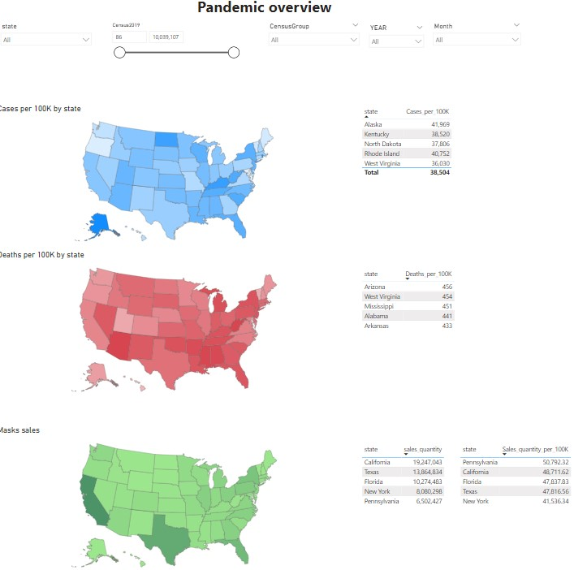
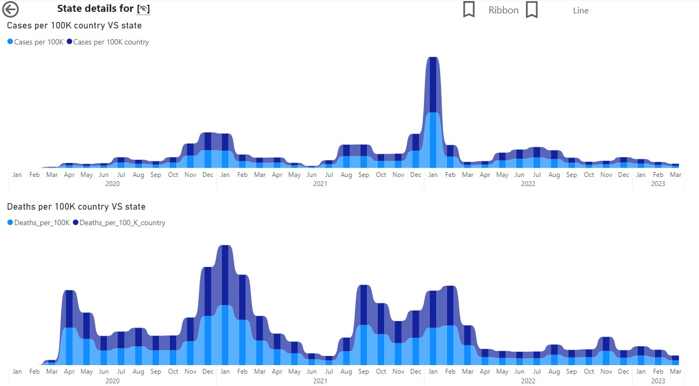
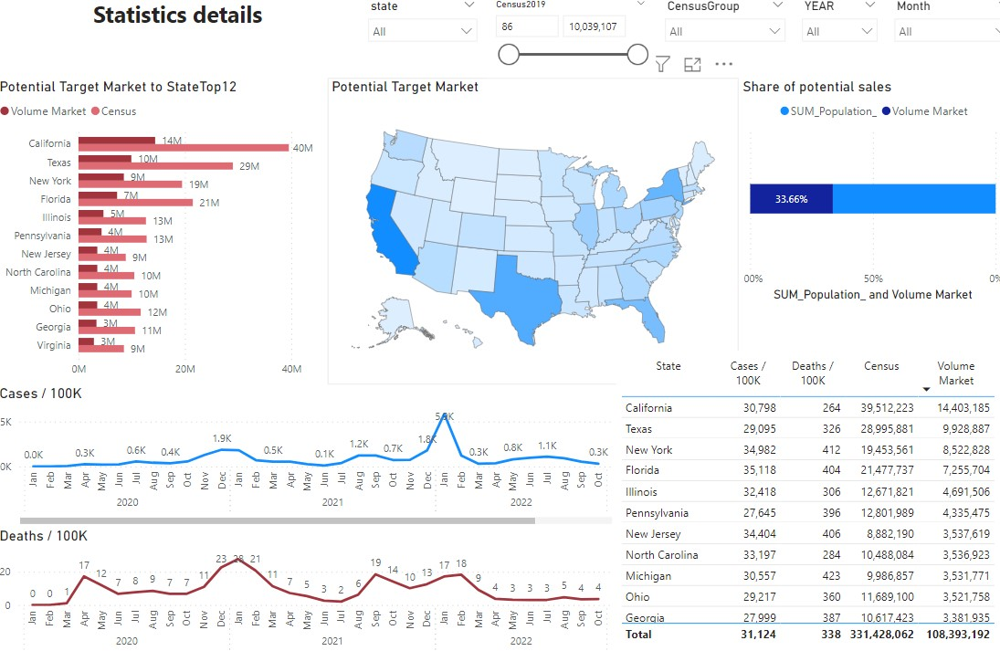
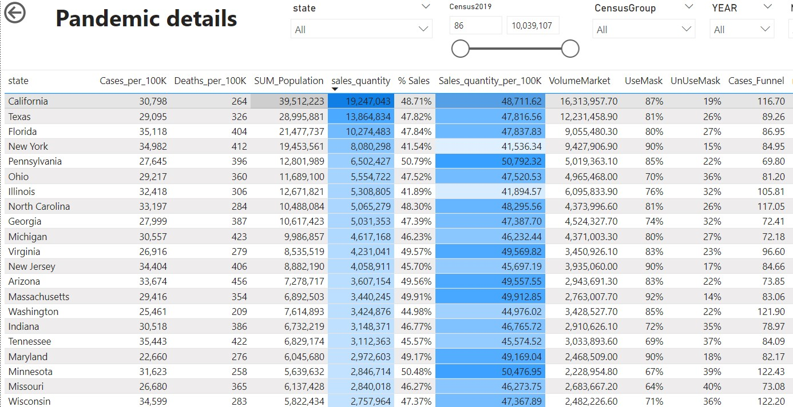

# ReportPandemic

The goal of this project is to get valuable insights from COVID-19 data for business. There is a company, which produces face masks and wanted to expand their market share The company plans a proper marketing campaign, and data analysts need to turn data into actionable insights for this goal.

## Main goal

The goal of this project is to get valuable insights from COVID-19 data for business.

## Business case

The mocked business case:

* There is a company, which produces face masks and wanted to expand their market share
* The company plans a proper marketing campaign, and data analysts need to turn data into actionable insights for this goal
* The hypothesis is that in states with the highest death rate, authorities will tighten rules for face masks wearing, and we evaluate a potential market volume in those states

## Data sources

The following data sources were used for this analytics:

* https://github.com/nytimes/covid-19-data - the main data source, COVID-19 related data collected and refined by NY Times. This data source includes info about cumulative cases and deaths for a whole pandemic duration and results of mask usage survey conducted on July 2020
* https://data.cdc.gov/Vaccinations/COVID-19-Vaccinations-in-the-United-States-County/8xkx-amqh - CDC’s Overall US COVID-19 Vaccine administration and vaccine equity data at county level. This data contains Census 2019 results to estimate population
* Face masks sales - synthetic data

## Analytical solution

The analytical solution is MS Power BI analytical dashboard.

All source data is in CSV format was downloaded from the corresponded repositories, transformed using Power Query and imported to Power BI using a desktop application; data is embedded into the dashboard.

The dashboard contains the following pages:

### Pandemic overview

It shows statistics about COVID-19 cases (per 100k), deaths (per 100k) and total mask sales per state. The charts can be filtered by state, dates and population attributes.

### State details

It shows dynamics of cases (per 100k) and deaths (per 100k) for a particular state for a whole pandemic duration on a monthly granularity. This page is connected to the first one to show data in context of user state selection.

### Statistics detail

It shows details about pandemic and its dynamics (the same metrics as on other pages). Also it contains a potential target market volume for face masks. The charts can be filtered by state, dates and population attributes.

This is a key dashboard, which can be used for making marketing decisions.

### Pandemic details

It contains detailed information about pandemic, population and mask usage metrics. This page is connected to the previous one to show data in context of user state selection. The charts can be filtered by state, dates and population attributes.

## Business outcome

The analytical solution allowed to identify California, Texas, New York and Florida as primary target states for the marketing campaign based on the hypothesis.